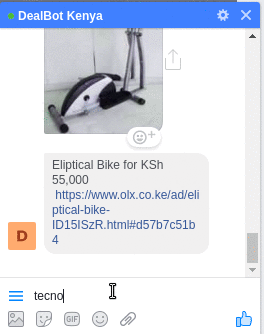

<p align="center">
	
</p>

Dealbot is a simple but powerful Chat bot connected to OLX, Cheki and Jumia which finds you a good deal.

| [Features][] | [Usage][] | [Getting Started][] | [Credits][] | [License][] |
|---|---|---|---|---|---|---|---|


## Features

- Bot is connected to **olx**, **jumia** and **checki**;
- Scrapers are **modular** so you can use them in other scenarios
- Ready for **API.ai** intergration
- Quick Replies for popular categories such as **phones**, **cars** and **clothing**

## Usage

- You need to have a page and an app subscribed to the messenger-platform

<a href="https://heroku.com/deploy?template=https://github.com/Bots54/DealBotKenya&env[PORT]=3000">
  
</a>

```
$ git clone
$ npm install
$ cp .env.example .env
$ node index.js
```
You need to enter your configs on the .env file
**Note:** If you don't know how to get these tokens, take a look at Facebook's [Quick Start Guide](https://developers.facebook.com/docs/messenger-platform/guides/quick-start) or check out [this issue](https://github.com/Charca/bootbot/issues/56).
- If you want to test your bot locally, install a localhost tunnel like [ngrok](https://ngrok.com/) and run it on your bot's port:

```
$ ngrok http 3000
```

Then use the provided HTTPS URL to config your webhook on Facebook's Dashboard. For example if the URL provided by ngrok is `https://99b8d4c2.ngrok.io`, use `https://99b8d4c2.ngrok.io/webhook`.

## Getting Started

- Visit Messenger and try to search for a deal, start simple eg: "HTC"
- Try it out [on Facebook](https://www.facebook.com/DealBot-Kenya-2031042363792292/)


## Credits

Made with :beer: by Geof Mureithi - [@mureithix](https://twitter.com/mureithix)

## License

MIT

[Features]:#features
[Usage]:#usage
[Getting Started]:#getting-started
[Credits]:#credits
[License]:#license
